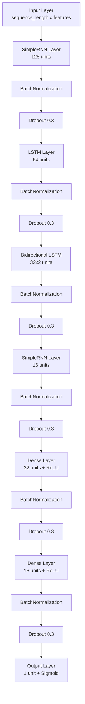
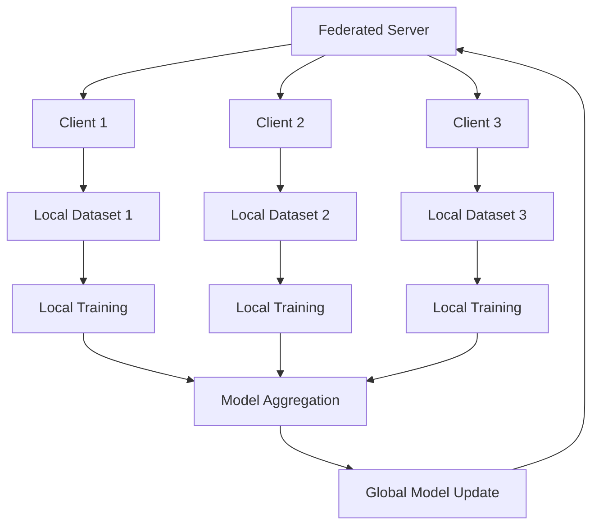

# Hybrid RNN-LSTM Network for Intrusion Detection with Federated Learning

## Project Overview
This project implements a hybrid deep learning model combining RNN and LSTM architectures for network intrusion detection. The model is designed to detect various types of network attacks using the NSL-KDD dataset. It supports both standalone and federated learning modes, leveraging the Flower framework for distributed training.

## Model Architecture


## Features
- Hybrid architecture combining RNN and LSTM layers
- PCA for dimensionality reduction
- Comprehensive preprocessing pipeline
- Advanced regularization techniques
- Detailed performance metrics and visualizations
- Federated learning support using Flower (flwr)
  - Distributed training across multiple clients
  - Secure model aggregation
  - Privacy-preserving learning

## Requirements
```python
numpy>=1.21.0
pandas>=1.3.0
tensorflow>=2.8.0
scikit-learn>=1.0.0
matplotlib>=3.4.0
seaborn>=0.11.0
flwr>=1.5.0  # For federated learning
```

## Installation
1. Clone the repository:
```bash
git clone <repository-url>
```

2. Navigate to the project directory:
```bash
cd <project-directory>
```

3. Install the required packages:
```bash
pip install -r requirements.txt
```

## Usage
- To train the model in standalone mode, run:
```bash
python intrusion-detection-lstm-rnn.py
```

- To train the model using federated learning, start the server and clients:
```bash
python server.py --port <port-number> --min-clients <number-of-clients> --rounds <number-of-rounds>
python client.py --client-id <client-id> --server-port <port-number>
```

## Results
- The model achieves high accuracy and demonstrates robust performance across various network attack scenarios.
- Detailed metrics and visualizations are available in the `fl_results` directory.

## Future Work
- Addressing class imbalance and optimizing ROC-AUC scores.
- Enhancing federated learning with adaptive client selection and secure aggregation.
- Exploring advanced deep learning models and real-world data testing.

## Federated Learning Architecture


## Federated Learning Features
- **Distributed Training**: Train models across multiple clients while keeping data local
- **Privacy Preservation**: Raw data never leaves client devices
- **Model Aggregation**: Secure aggregation of model updates using FedAvg strategy
- **Scalability**: Support for dynamic number of clients
- **Fault Tolerance**: Robust to client failures and dropouts

## Output Files
The model generates several output files:
- `pca_explained_variance.png`: PCA variance plot
- `confusion_matrices.png`: Training and test confusion matrices
- `roc_curve_training.png`: ROC curve for training data
- `roc_curve_test.png`: ROC curve for test data
- `pr_curve_training.png`: Precision-Recall curve for training
- `pr_curve_test.png`: Precision-Recall curve for test
- `evaluation_metrics.txt`: Detailed performance metrics
- `detailed_results.txt`: Comprehensive results and timing information

## Performance Metrics
The model evaluates performance using:
- Accuracy
- Precision
- Recall
- F1-Score
- ROC-AUC
- Confusion Matrix

## Contributing
Contributions are welcome! Please feel free to submit a Pull Request.

## License
This project is licensed under the MIT License - see the LICENSE file for details.

## Citation
If you use this code in your research, please cite:
```
@misc{hybrid-rnn-lstm-ids,
  author = {Your Name},
  title = {Hybrid RNN-LSTM Network for Intrusion Detection},
  year = {2024},
  publisher = {GitHub},
  url = {<repository-url>}
}
``` 