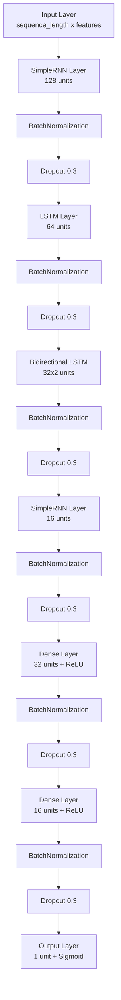

# Hybrid RNN-LSTM Network for Intrusion Detection

## Project Overview
This project implements a hybrid deep learning model combining RNN and LSTM architectures for network intrusion detection. The model is designed to detect various types of network attacks using the KDD Cup '99 dataset.

## Model Architecture


## Features
- Hybrid architecture combining RNN and LSTM layers
- PCA for dimensionality reduction
- Comprehensive preprocessing pipeline
- Advanced regularization techniques
- Detailed performance metrics and visualizations

## Requirements
```python
numpy
pandas
tensorflow
scikit-learn
matplotlib
seaborn
```

## Installation
1. Clone the repository:
```bash
git clone <repository-url>
cd intrusion-detection-system
```

2. Install dependencies:
```bash
pip install -r requirements.txt
```

## Dataset
The model uses the KDD Cup '99 dataset which should be placed in the root directory:
- `KDDTrain+.txt`: Training dataset
- `KDDTest+.txt`: Testing dataset

## Model Components

### 1. Data Preprocessing
- Label encoding for categorical features
- Robust scaling for numerical features
- PCA dimensionality reduction
- Sequence preparation for RNN/LSTM processing

### 2. Model Architecture
1. **Input Layer**
   - Accepts sequences of preprocessed features

2. **RNN Layer (128 units)**
   - Initial feature extraction
   - Returns sequences for deeper processing

3. **LSTM Layer (64 units)**
   - Complex pattern recognition
   - Enhanced memory capabilities

4. **Bidirectional LSTM Layer (32 units)**
   - Processes sequences in both directions
   - Captures temporal dependencies

5. **RNN Layer (16 units)**
   - Final sequence processing
   - Feature summarization

6. **Dense Layers**
   - Dimensionality reduction and classification
   - Final binary prediction

### 3. Training Features
- Early stopping to prevent overfitting
- Learning rate reduction on plateau
- Batch normalization
- Dropout regularization (30%)
- L2 regularization

## Usage
```python
from intrusion_detection_lstm_rnn import IntrusionDetectionSystem

# Initialize the model
ids = IntrusionDetectionSystem(sequence_length=5, n_components=20)

# Train the model
ids.train(X_train, y_train)

# Evaluate performance
metrics = ids.evaluate_model(X_train, X_test, y_train, y_test)
```

## Output Files
The model generates several output files:
- `pca_explained_variance.png`: PCA variance plot
- `confusion_matrices.png`: Training and test confusion matrices
- `roc_curve_training.png`: ROC curve for training data
- `roc_curve_test.png`: ROC curve for test data
- `pr_curve_training.png`: Precision-Recall curve for training
- `pr_curve_test.png`: Precision-Recall curve for test
- `evaluation_metrics.txt`: Detailed performance metrics
- `detailed_results.txt`: Comprehensive results and timing information

## Performance Metrics
The model evaluates performance using:
- Accuracy
- Precision
- Recall
- F1-Score
- ROC-AUC
- Confusion Matrix

## Contributing
Contributions are welcome! Please feel free to submit a Pull Request.

## License
This project is licensed under the MIT License - see the LICENSE file for details.

## Citation
If you use this code in your research, please cite:
```
@misc{hybrid-rnn-lstm-ids,
  author = {Your Name},
  title = {Hybrid RNN-LSTM Network for Intrusion Detection},
  year = {2024},
  publisher = {GitHub},
  url = {<repository-url>}
}
``` 